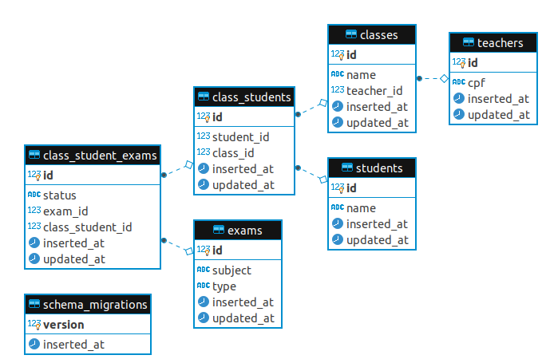

# ClassManagementApi

## ERD


## Setup Postman Collection
Import [Class Management.postman_collection.json](https://github.com/AlysonBasilio/class_management_api/blob/master/docs/Class%20Management.postman_collection.json) to your Postman and start to use all Routes.

## Routes
```
                   token_path  POST    /api/generate-token                    ClassManagementApiWeb.TokenController :create
      class_student_exam_path  PATCH   /api/class-student-exam/:id            ClassManagementApiWeb.ClassStudentExamController :update
                               PUT     /api/class-student-exam/:id            ClassManagementApiWeb.ClassStudentExamController :update
                   class_path  GET     /api/classes                           ClassManagementApiWeb.ClassController :index
                   class_path  GET     /api/classes/:id                       ClassManagementApiWeb.ClassController :show
                   class_path  POST    /api/classes                           ClassManagementApiWeb.ClassController :create
                   class_path  PATCH   /api/classes/:id                       ClassManagementApiWeb.ClassController :update
                               PUT     /api/classes/:id                       ClassManagementApiWeb.ClassController :update
                   class_path  DELETE  /api/classes/:id                       ClassManagementApiWeb.ClassController :delete
class_class_student_exam_path  POST    /api/classes/:class_id/apply-exam      ClassManagementApiWeb.ClassStudentExamController :apply_exam_to_class
     class_class_student_path  POST    /api/classes/:class_id/enroll-student  ClassManagementApiWeb.ClassStudentController :enroll_student
           class_student_path  GET     /api/classes/:class_id/students        ClassManagementApiWeb.StudentController :index_class_students
                 teacher_path  GET     /api/teachers                          ClassManagementApiWeb.TeacherController :index
                 teacher_path  GET     /api/teachers/:id                      ClassManagementApiWeb.TeacherController :show
                 teacher_path  POST    /api/teachers                          ClassManagementApiWeb.TeacherController :create
                 teacher_path  PATCH   /api/teachers/:id                      ClassManagementApiWeb.TeacherController :update
                               PUT     /api/teachers/:id                      ClassManagementApiWeb.TeacherController :update
                 teacher_path  DELETE  /api/teachers/:id                      ClassManagementApiWeb.TeacherController :delete
                 student_path  GET     /api/students                          ClassManagementApiWeb.StudentController :index
                 student_path  GET     /api/students/:id                      ClassManagementApiWeb.StudentController :show
                 student_path  POST    /api/students                          ClassManagementApiWeb.StudentController :create
                 student_path  PATCH   /api/students/:id                      ClassManagementApiWeb.StudentController :update
                               PUT     /api/students/:id                      ClassManagementApiWeb.StudentController :update
                 student_path  DELETE  /api/students/:id                      ClassManagementApiWeb.StudentController :delete
                    exam_path  GET     /api/exams                             ClassManagementApiWeb.ExamController :index
                    exam_path  GET     /api/exams/:id                         ClassManagementApiWeb.ExamController :show
                    exam_path  POST    /api/exams                             ClassManagementApiWeb.ExamController :create
                    exam_path  PATCH   /api/exams/:id                         ClassManagementApiWeb.ExamController :update
                               PUT     /api/exams/:id                         ClassManagementApiWeb.ExamController :update
                    exam_path  DELETE  /api/exams/:id                         ClassManagementApiWeb.ExamController :delete
```

## Setup Dockerized Development Environment

```
source dev.sh
```

## Setup Non Dockerized Development Environment

To start your Phoenix server:

  * Install dependencies with `mix deps.get`
  * Create and migrate your database with `mix ecto.setup`
  * Start Phoenix endpoint with `mix phx.server`

Now you can visit [`localhost:4000`](http://localhost:4000) from your browser.

Ready to run in production? Please [check our deployment guides](https://hexdocs.pm/phoenix/deployment.html).

## Learn more

  * Official website: https://www.phoenixframework.org/
  * Guides: https://hexdocs.pm/phoenix/overview.html
  * Docs: https://hexdocs.pm/phoenix
  * Forum: https://elixirforum.com/c/phoenix-forum
  * Source: https://github.com/phoenixframework/phoenix
